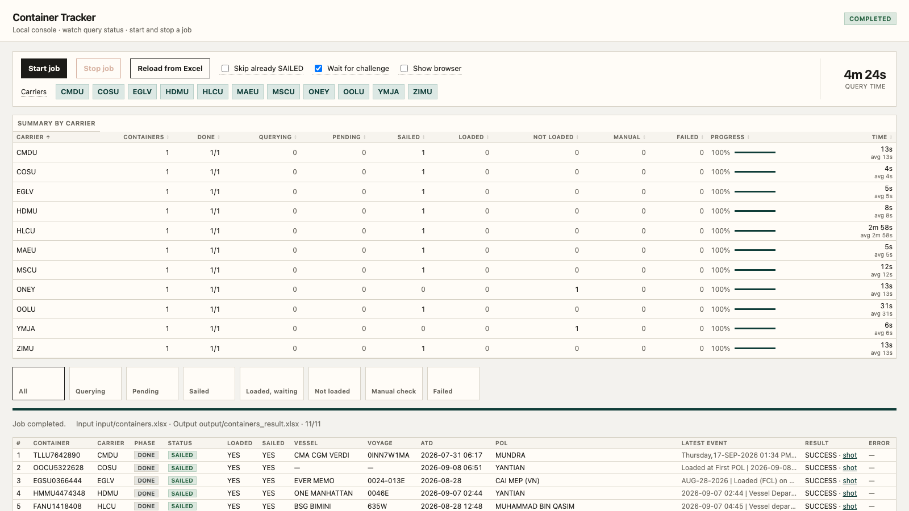
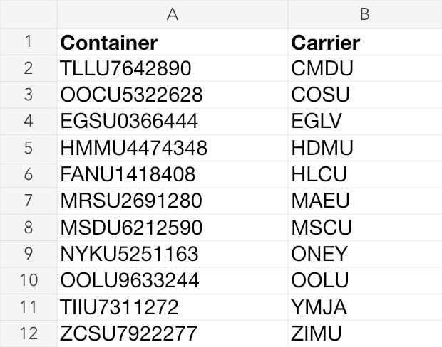

# Container Tracker MVP / 集装箱追踪 MVP

本项目是在 macOS 本地运行的集装箱追踪工具。它从 Excel 读取箱号和船公司，访问船公司公开的 Tracking 页面，并判断集装箱是否已经装上海船、是否已经开船。

This project is a local macOS container-tracking tool. It reads container numbers and carriers from Excel, checks the carriers' public tracking pages, and determines whether each container has been loaded onto an ocean vessel and whether that vessel has departed.

代码、CLI、Excel 表头、状态值和错误信息保持英文。业务规则详见 [`design/container_tracking_mvp_plan.md`](design/container_tracking_mvp_plan.md)。

Code identifiers, CLI text, Excel headers, status values, and errors remain in English. See [`design/container_tracking_mvp_plan.md`](design/container_tracking_mvp_plan.md) for detailed business rules.

## Project overview / 项目概览

The local web console shows batch controls, per-carrier progress, query time, and the latest result for every container.

本地网页控制台集中展示批量任务控制、各船公司进度、查询耗时，以及每个集装箱的最新结果。



The input workbook is intentionally simple: add one container per row and select the matching carrier code. The tracker reads this file and writes the detailed results to `output/containers_result.xlsx`.

输入表保持简洁：每行填写一个箱号及对应的船公司代码。程序读取该文件，并把详细结果写入 `output/containers_result.xlsx`。



## Supported carriers / 支持的船公司

| Code | Carrier / 船公司 | Browser mode / 浏览器模式 | Human supervision / 人工监督 |
|---|---|---|---|
| `HLCU` | Hapag-Lloyd | Normal system Chrome / 本机普通 Chrome | Complete Cloudflare if shown / 出现 Cloudflare 时人工完成 |
| `YMJA` | Yang Ming / 阳明海运 | Headless by default / 默认无头 | Normally unattended / 通常无需值守 |
| `ONEY` | Ocean Network Express (ONE) | Headless by default / 默认无头 | Normally unattended / 通常无需值守 |
| `MSCU` | MSC | Visible Playwright Chrome / 可见自动化 Chrome | May require a system-Chrome handoff / 可能需要交接到普通 Chrome |
| `MAEU` | Maersk / 马士基 | Visible Playwright Chrome / 可见自动化 Chrome | Complete CAPTCHA in the current window / 在当前窗口完成验证码 |
| `CMDU` | CMA CGM / 达飞 | Normal system Chrome / 本机普通 Chrome | Complete DataDome if shown / 出现 DataDome 时人工完成 |
| `OOLU` | OOCL / 东方海外 | Normal system Chrome / 本机普通 Chrome | **Continuous supervision strongly recommended / 强烈建议全程人工监督** |
| `HDMU` | HMM / 现代商船 | Normal system Chrome / 本机普通 Chrome | Complete access check if shown / 出现访问检查时人工完成 |
| `COSU` | COSCO Shipping Lines / 中远海运 | Headless by default / 默认无头 | Normally unattended / 通常无需值守 |
| `EGLV` | Evergreen Line / 长荣海运 | Headless by default / 默认无头 | Normally unattended / 通常无需值守 |
| `ZIMU` | ZIM / 以星航运 | Normal system Chrome / 本机普通 Chrome | Complete hCaptcha if shown / 出现 hCaptcha 时人工完成 |

Each carrier uses a persistent profile under `sessions/chrome_{code}/`. Playwright-based carriers prefer the installed Google Chrome and fall back to Playwright Chromium. Native carriers (`HLCU`, `CMDU`, `OOLU`, `HDMU`, and `ZIMU`) reuse the login and verification state in normal system Chrome and get a separate tracking window for each carrier.

每家船公司都使用 `sessions/chrome_{code}/` 下的独立持久资料目录。Playwright 查询优先使用已安装的 Google Chrome，不可用时退回 Playwright Chromium。原生查询船公司（`HLCU`、`CMDU`、`OOLU`、`HDMU`、`ZIMU`）复用本机普通 Chrome 中已有的登录和验证状态，并为每家创建独立查询窗口。

## Installation / 安装

```bash
python3 -m venv .venv
source .venv/bin/activate
pip install -r requirements.txt
playwright install chromium
```

Native Chrome control on macOS compiles a small ScriptingBridge helper with `xcrun clang` on first use. Xcode Command Line Tools must be installed; run `xcode-select --install` if they are missing.

macOS 原生 Chrome 查询会在首次使用时通过 `xcrun clang` 编译一个 ScriptingBridge 小程序。机器必须已安装 Xcode Command Line Tools；缺少时运行 `xcode-select --install`。

If Chrome reports that JavaScript from Apple Events is disabled, enable **View → Developer → Allow JavaScript from Apple Events** in normal Google Chrome. macOS may also ask for Automation or Screen Recording permission; allow it for the terminal or process running this tool.

如果 Chrome 提示未允许来自 Apple 事件的 JavaScript，请在普通 Google Chrome 中打开 **查看 → 开发者 → 允许 Apple 事件中的 JavaScript**。macOS 也可能请求“自动化”或“屏幕录制”权限，请授权给运行本工具的终端或进程。

## Input workbook / 输入表格

Edit `input/containers.xlsx`. Put container numbers in the `Container` column starting from row 2, and put a supported carrier code in `Carrier`. Do not fill in POL: the program infers it from the first ocean-vessel loading event of the latest journey.

编辑 `input/containers.xlsx`：从第 2 行起把箱号填入 `Container` 列，并在 `Carrier` 列填写支持的船公司代码。不要填写 POL；程序会根据最新一程中首次海船装船事件推断。

Accepted header aliases include `箱号`, `集装箱号`, `船公司`, and `SCAC`. Extra columns are copied to the result workbook. `Carrier` is authoritative; the program never guesses it from the container prefix. For example, an HMM container may start with `DFSU`, while `Carrier` must still be `HDMU`.

也接受 `箱号`、`集装箱号`、`船公司`、`SCAC` 等表头别名。多余列会原样带到结果表。程序以 `Carrier` 列为准，不通过箱号前缀猜船公司。例如，HMM 的箱号可以以 `DFSU` 开头，但 `Carrier` 仍应填写 `HDMU`。

Rows are deduplicated by `Container + Carrier` while preserving the first occurrence. Spaces and hyphens are removed and letters are uppercased. A bad ISO 6346 check digit produces a log warning but does not prevent the query.

读入时按 `Container + Carrier` 去重并保留首行。箱号中的空格和连字符会被移除，字母会转为大写。ISO 6346 校验位不正确时只记录日志警告，不会阻止查询。

## Batch execution order / 批量执行顺序

The runner uses two lanes at the same time, so there is no single global carrier order:

批量任务同时运行两条泳道，因此不存在一个覆盖所有船公司的绝对先后顺序：

1. **Parallel headless lane / 并行无头泳道:** `ONEY`, `YMJA`, `COSU`, and `EGLV` start in parallel when present.
2. **Serial visible lane / 串行可见泳道:** present carriers run in this fixed order: `OOLU → HLCU → MSCU → MAEU → CMDU → HDMU → ZIMU`.
3. Inside each carrier worker, containers are processed one at a time in input order. One persistent browser/profile is reused for the whole carrier batch.
4. Manual-verification prompts are serialized so only one carrier asks for human action at a time. Other automated work may continue in parallel.

对应中文说明：

1. **并行无头泳道：** 输入中存在的 `ONEY`、`YMJA`、`COSU`、`EGLV` 会并行启动。
2. **串行可见泳道：** 输入中存在的船公司按固定顺序 `OOLU → HLCU → MSCU → MAEU → CMDU → HDMU → ZIMU` 依次运行。
3. 每家船公司的 worker 都按输入顺序逐箱处理，并在整批中复用同一个浏览器和资料目录。
4. 人工验证请求会串行化，保证同一时间只要求处理一家；其他无需人工操作的任务仍可并行继续。

Between containers, the runner waits 2–4 seconds for normal headless carriers, 5–8 seconds for challenge-prone carriers, and 3 seconds for HMM. Two consecutive `CLOUDFLARE`, `CAPTCHA`, or `SELECTOR` errors pause the remaining rows for that carrier without stopping other carriers.

每个箱号之间，普通无头船公司等待 2–4 秒，容易触发验证的船公司等待 5–8 秒，HMM 固定等待 3 秒。同一家连续两箱出现 `CLOUDFLARE`、`CAPTCHA` 或 `SELECTOR` 时会暂停该家剩余行，但不会停止其他船公司。

## Carrier-by-carrier operating procedure / 各船公司详细操作方法

### `HLCU` — Hapag-Lloyd

中文操作顺序：

1. 程序用 HLCU 专用资料目录打开本机普通 Chrome 和 Hapag-Lloyd Tracking 页面。
2. 如出现 Cloudflare，在当前 HLCU 窗口中完成人机验证，**保持窗口打开**；程序最多等待 10 分钟并在放行后自动继续。
3. 程序关闭 Cookie/新手引导，在 Tracking 表单输入箱号并点击 Search/Track；不使用更容易重新触发挑战的箱号深链。
4. 结果出现后，程序展开右侧明细，解析事件并保存结果区截图和 HTML。
5. 程序复用同一查询页面，等待 5–8 秒后查询下一箱。整批结束后只关闭本次 HLCU 查询窗口。

English sequence:

1. The runner opens Hapag-Lloyd Tracking in normal system Chrome with the dedicated HLCU profile.
2. If Cloudflare appears, complete it in the current HLCU window and **keep the window open**. The runner waits up to 10 minutes and resumes automatically.
3. It dismisses cookies/onboarding, enters the container in the form, and selects Search/Track. It does not use a container deep link.
4. It expands movement details, parses events, and saves a result-area screenshot and HTML.
5. It reuses the same page for the next container after 5–8 seconds and closes only this run's HLCU window at the end.

### `YMJA` — Yang Ming / 阳明海运

中文操作顺序：

1. 程序默认启动无头浏览器并打开 Yang Ming Cargo Tracking。
2. 如果当前仍是上一箱结果页，程序先点击返回查询表单；找不到表单时重新打开入口页。
3. 程序逐字符输入箱号（确保 React 表单收到键盘事件），然后点击 Search，必要时用 Enter 提交。
4. 程序等待对应箱号的 Container Status 结果，解析并保存证据。
5. 同一浏览器等待 2–4 秒后继续下一箱；通常无需人工监督。

English sequence:

1. A headless browser opens Yang Ming Cargo Tracking by default.
2. If the previous result is open, the runner returns to the form; if it cannot recover the form, it reloads the entry page.
3. It types the container character by character so the React form receives key events, then selects Search or falls back to Enter.
4. It waits for the matching Container Status result, parses it, and saves evidence.
5. The same browser continues after 2–4 seconds. Human supervision is normally unnecessary.

### `ONEY` — Ocean Network Express (ONE)

中文操作顺序：

1. 程序默认用无头浏览器打开 ONE Cargo Tracking，并关闭可能出现的新手引导。
2. 查询类型会切换为 `Container No.`；上一箱留下的搜索 chip 会先清除。
3. 程序输入箱号并点击搜索，必要时用 Enter 提交或重新进入结果地址。
4. 程序等待事件表，解析完整动态并保存结果截图和 HTML。
5. 同一浏览器等待 2–4 秒后继续下一箱；通常无需人工监督。

English sequence:

1. A headless browser opens ONE Cargo Tracking and dismisses optional onboarding.
2. Search type is set to `Container No.`, and any chip left by the previous query is cleared.
3. The runner enters the container and submits, falling back to Enter or result navigation when needed.
4. It waits for the event table, parses the movement history, and saves the screenshot and HTML.
5. The same browser continues after 2–4 seconds. Human supervision is normally unnecessary.

### `MSCU` — MSC

中文操作顺序：

1. MSC 默认使用可见的 Playwright Chrome，因为无头模式容易被拦截。
2. 程序选择 Container 查询类型，在 `trackingNumber` 输入框逐字符输入箱号，然后点击搜索或按 Enter。
3. 如自动化窗口遇到无法完成的安全检查，程序会关闭该窗口并用同一资料目录打开普通系统 Chrome。
4. 在普通 Chrome 中完成验证，等搜索框出现后按 **Cmd+Q 完全退出该 Chrome**；程序重新打开资料目录并自动查询，无需手工输入箱号。
5. 结果出现后程序展开进度明细、解析和保存证据，再查询下一箱。

English sequence:

1. MSC uses visible Playwright Chrome because headless access is commonly blocked.
2. The runner selects container search, types into `trackingNumber` character by character, and selects Search or presses Enter.
3. If the automated window reaches an unresolved security check, it closes that window and opens normal system Chrome with the same profile.
4. Complete verification, wait for the search box, and **quit that Chrome completely with Cmd+Q**. The runner reopens the profile and submits automatically; do not type the container manually.
5. It expands progress details, parses and saves evidence, and continues to the next container.

### `MAEU` — Maersk / 马士基

中文操作顺序：

1. 程序用可见的持久化 Playwright Chrome 打开 Maersk Tracking，并绑定本次查询的网页响应。
2. 若出现验证码或安全检查，请在**当前 MAEU 自动化窗口**完成并保持窗口打开；通过后程序自动继续。
3. 程序在 Tracking 表单输入箱号并点击 Track/Search；不使用 GET 箱号深链。
4. 程序优先解析与当前箱号匹配的 Tracking 响应，必要时解析页面事件表，并保存结果证据。
5. 同一窗口等待 5–8 秒后继续下一箱。

English sequence:

1. Visible persistent Playwright Chrome opens Maersk Tracking and listens for the matching tracking response.
2. Complete a CAPTCHA/security check in the **current MAEU automation window** and keep it open; processing resumes automatically.
3. The runner enters the container and selects Track/Search; it does not use a GET container deep link.
4. It prefers the matching response, falls back to the page's event table, and saves evidence.
5. The same window continues after 5–8 seconds.

### `CMDU` — CMA CGM / 达飞

中文操作顺序：

1. 程序用 CMDU 专用资料目录打开本机普通 Chrome 和 CMA CGM Tracking。
2. 如出现 DataDome/CAPTCHA，请在当前 CMDU 窗口完成验证并**保持窗口打开**；验证框提示“没有互联网接入”时应检查网络、代理/VPN，或联系船公司支持。
3. 程序关闭 Cookie/会话超时提示，在表单输入箱号并通过 POST 表单提交；不使用 GET 箱号深链。
4. 程序展开 `Previous Moves`，解析事件并保存证据。还箱超过约 15 天的箱号可能在官网没有结果。
5. 同一窗口等待 5–8 秒后继续下一箱。

English sequence:

1. Normal system Chrome opens CMA CGM Tracking with the dedicated CMDU profile.
2. Complete DataDome/CAPTCHA in the current CMDU window and **keep it open**. If it says there is no internet access, check the network, proxy/VPN, or contact carrier support.
3. The runner dismisses cookie/session prompts, enters the container, and submits the POST form. It does not use a GET deep link.
4. It expands `Previous Moves`, parses events, and saves evidence. The public site may return no result roughly 15 days after empty return.
5. The same window continues after 5–8 seconds.

### `OOLU` — OOCL / 东方海外

> **重要：OOLU 批次强烈建议全程有人监督。OOCL 的验证码可能在打开入口页时出现，也可能在某个箱号提交后不定时再次出现；不要只在任务开始时验证一次后离开。**
>
> **Important: continuous human supervision is strongly recommended for the entire OOLU batch. OOCL may show a CAPTCHA when the entry page opens or unexpectedly after a later container is submitted. Do not assume that one verification at startup makes the rest of the batch unattended.**

中文操作顺序：

1. OOLU 是可见浏览器串行泳道中的第一家。程序用 OOLU 专用资料目录打开本机普通 Chrome 的 Cargo Tracking 入口页。
2. **在整批 OOLU 查询期间留在电脑旁观察这个窗口。** 页面出现 CAPTCHA 时立即在当前窗口人工完成；不要刷新、不要另开查询页、不要关闭入口窗口。程序最多等待 10 分钟，并在验证消失后自动继续，不需要点击终端或网页控制台中的“继续”。
3. 如果 Chrome 阻止自动控制，请开启 **查看 → 开发者 → 允许 Apple 事件中的 JavaScript**，然后继续完成 CAPTCHA；窗口仍须保持打开。
4. 程序在入口页选择 Cargo/Container 查询，输入箱号并提交。OOCL 会为该箱新开一个结果页签；程序自动跟随这个页签。
5. 程序等待结果、打开 View Details/事件抽屉、解析动态并保存截图和 HTML。
6. 当前箱处理完后，程序只关闭结果页签，回到保留的 Cargo Tracking 入口页，等待 5–8 秒后输入下一箱。不要手工关闭或替换入口页签。
7. 后续箱通常不会再次验证，但验证码可能不定时回归；若再次出现，立即在当前窗口完成。**同一箱人工验证后又再次被拦时，该箱会记录失败；连续两箱被拦会暂停 OOLU 剩余行。**
8. 需要中止时使用网页控制台的 Stop；程序会取消等待并安全保存已完成结果。不要通过关闭 Chrome 来代替 Stop，否则会记录 `BROWSER_CLOSED` 或 `TAB_NOT_FOUND`。

English sequence:

1. OOLU is first in the serial visible-browser lane. Normal system Chrome opens the OOCL Cargo Tracking entry page with the dedicated OOLU profile.
2. **Stay at the computer and watch this window for the entire OOLU batch.** Complete CAPTCHA immediately in the current window. Do not refresh, open another tracking page, or close the entry window. The runner waits up to 10 minutes and resumes automatically; there is no Continue button.
3. If Chrome blocks automation, enable **View → Developer → Allow JavaScript from Apple Events**, then complete CAPTCHA while keeping the window open.
4. The runner selects Cargo/Container tracking, enters the container, and submits it. OOCL opens a new result tab, which the runner follows automatically.
5. It waits for results, opens View Details/the event drawer, parses movements, and saves the screenshot and HTML.
6. It closes only the result tab, returns to the preserved entry tab, waits 5–8 seconds, and enters the next container. Do not close or replace the entry tab.
7. CAPTCHA can return unpredictably. Complete it immediately. **If the same container is blocked again after its human-verification attempt, that row fails; two consecutive blocked rows pause the remaining OOLU rows.**
8. Use Stop to abort. It cancels the wait and safely writes completed results. Closing Chrome instead can produce `BROWSER_CLOSED` or `TAB_NOT_FOUND`.

### `HDMU` — HMM / 现代商船

中文操作顺序：

1. 程序用 HDMU 专用资料目录打开本机普通 Chrome 和 HMM Track & Trace。箱号前缀不必是 `HDMU`，但 Excel 中的 Carrier 必须填 `HDMU`。
2. 若出现 Access Denied、abnormal connection 或 HMM access check，请在当前窗口完成处理并保持窗口打开；程序放行后自动继续。
3. 程序在可见表单输入并提交箱号；上一箱结果页没有可用输入框时，会先返回入口页。
4. 程序打开 `Display Previous Moves`，解析结果并保存证据。
5. 同一窗口固定等待 3 秒后继续下一箱。

English sequence:

1. Normal system Chrome opens HMM Track & Trace with the dedicated HDMU profile. The container prefix need not be `HDMU`, but Excel `Carrier` must be `HDMU`.
2. Resolve Access Denied, abnormal connection, or an HMM access check in the current window and keep it open. The runner resumes automatically.
3. It enters and submits the container. If the result page has no usable input, it returns to the entry page first.
4. It opens `Display Previous Moves`, parses the result, and saves evidence.
5. The same window continues after a fixed 3-second delay.

### `COSU` — COSCO Shipping Lines / 中远海运

中文操作顺序：

1. 程序默认用无头浏览器打开 COSCO Cargo Tracking。
2. 优先在入口表单输入箱号并点击 Search；若表单未返回对应结果，则打开该箱的结果地址作为回退。
3. 程序核对结果页显示的箱号，避免把上一箱的缓存结果误写到当前箱。
4. 程序解析 `Dynamic Node`/事件表并保存证据；页面仍显示其他箱号时会重试，仍不匹配则记录 `PARSE`。
5. 同一浏览器等待 2–4 秒后继续下一箱；通常无需人工监督。

English sequence:

1. A headless browser opens COSCO Cargo Tracking by default.
2. The runner submits the entry form first, then falls back to the container result URL if no matching result appears.
3. It verifies the displayed container so a cached previous result is never assigned to the current row.
4. It parses `Dynamic Node`/the event table and saves evidence. A stale page is retried; a persistent mismatch becomes `PARSE`.
5. The same browser continues after 2–4 seconds. Human supervision is normally unnecessary.

### `EGLV` — Evergreen Line / 长荣海运

中文操作顺序：

1. 程序默认使用无头浏览器，并向长荣中国 ShipmentLink 的箱号查询表单发送请求。
2. 返回的 HTML 会加载到浏览器中，程序确认页面属于当前箱号并包含有效状态标记。
3. 匿名查询通常只返回最新一条货柜动态；程序只依据官网可见内容判断，不补造不可见的历史事件、POL 或 ATD。
4. 首次出现 `NAVIGATION` 时程序等待 3 秒自动重试一次，以第二次结果作为最终结果。
5. 程序解析最新动态、保存证据，并等待 2–4 秒后继续下一箱；通常无需人工监督。

English sequence:

1. A headless browser is used by default, and the runner submits a container-form request to Evergreen China ShipmentLink.
2. Returned HTML is loaded into the browser and checked for the current container and a recognized status marker.
3. Anonymous tracking normally exposes only the latest movement. The runner uses only visible evidence and does not invent history, POL, or ATD.
4. A first `NAVIGATION` result is retried once after 3 seconds; the second attempt is final.
5. The latest movement is parsed and evidence saved before the next container starts after 2–4 seconds. Human supervision is normally unnecessary.

### `ZIMU` — ZIM / 以星航运

中文操作顺序：

1. 程序用 ZIMU 专用资料目录打开本机普通 Chrome 的 `Track a Shipment` 页面。
2. 如出现 hCaptcha，请在当前 ZIMU 窗口完成并保持窗口打开；程序最多等待 10 分钟并自动继续。
3. 程序清除上一箱留下的搜索 chip，在表单输入箱号并点击 Search/按 Enter；不使用箱号深链。
4. 程序等待与当前箱号匹配的 Activity 结果，解析并保存证据。
5. 同一窗口等待 5–8 秒后继续下一箱。

English sequence:

1. Normal system Chrome opens ZIM's `Track a Shipment` page with the dedicated ZIMU profile.
2. Complete hCaptcha in the current ZIMU window and keep it open. The runner waits up to 10 minutes and resumes automatically.
3. It clears the previous search chip, enters the container, and selects Search or presses Enter. It does not use a deep link.
4. It waits for Activity results matching the current container, parses them, and saves evidence.
5. The same window continues after 5–8 seconds.

## Web console / 本地网页控制台

```bash
./serve.sh
```

Or / 或：

```bash
source .venv/bin/activate
python app.py --serve
```

The app opens `http://127.0.0.1:8765/`, reads `input/containers.xlsx`, and writes `output/containers_result.xlsx`. Only one batch can run at a time. Use `--host` and `--port` to change the bind address.

程序会打开 `http://127.0.0.1:8765/`，读取 `input/containers.xlsx`，并写入 `output/containers_result.xlsx`。同一时间只能运行一批任务。可用 `--host` 和 `--port` 修改绑定地址。

- **Start / Stop / Reload from Excel** — start, stop after the current container, or reload input/results / 开始、在当前箱完成后停止、重新载入输入和结果。
- **Skip already SAILED** — reuse existing `SAILED` rows / 复用已有 `SAILED` 行。
- **Wait for challenge** — wait for human verification; enabled by default / 等待人工验证；默认开启。
- **Show browser** — show all Playwright browsers; challenge-prone carriers remain visible even when off / 显示全部 Playwright 浏览器；关闭时易触发验证的船公司仍保持可见。
- Carrier filters, Summary/status filters, and per-carrier progress show running and completed work / 船公司筛选、状态筛选和分船公司进度用于查看执行情况。

The page shows the active challenge and required action. Stop cancels a verification wait. Completed rows are saved; unqueried rows remain blank.

页面会显示当前验证码和所需操作。Stop 可取消验证等待；已完成行会保存，未查询行保持空白。

## Command line / 命令行

Single container / 单箱查询：

```bash
python app.py --carrier HLCU --container HLXU1234567
python app.py --carrier YMJA --container YMLU1234567
python app.py --carrier ONEY --container ONEU1234567
python app.py --carrier MSCU --container MSCU1234567
python app.py --carrier MAEU --container MSKU1234567
python app.py --carrier CMDU --container CMAU1234567
python app.py --carrier OOLU --container OOLU6895702
python app.py --carrier HDMU --container DFSU7369437
python app.py --carrier COSU --container CSNU6609294
python app.py --carrier EGLV --container EGHU8519309
python app.py --carrier ZIMU --container TCNU3698035
```

Batch / 批量查询：

```bash
python app.py input/containers.xlsx
python app.py input/containers.xlsx --carriers HLCU,YMJA --limit 20
python app.py input/containers.xlsx --resume
python app.py input/containers.xlsx --output output/today.xlsx
```

| Option / 参数 | Description / 作用 |
|---|---|
| `--headed` | Force a visible browser for debugging / 强制显示浏览器用于调试 |
| `--wait-challenge` | Wait for human verification; already the default / 等待人工验证；已是默认值 |
| `--no-wait-challenge` | Do not wait for a human; fail and possibly pause that carrier / 无人值守；遇到验证直接失败并可能暂停该家 |
| `--carriers HLCU,YMJA` | Run only listed carriers / 只查询列出的船公司 |
| `--limit N` | Process at most N rows after deduplication/grouping / 去重分组后最多查询 N 行 |
| `--resume` | Reuse existing `SAILED` rows / 复用已有 `SAILED` 行 |
| `--output PATH` | Set result workbook path / 指定结果表路径 |
| `--serve` | Start local web console / 启动本地网页控制台 |

For unattended execution / 完全无人值守：

```bash
python app.py input/containers.xlsx --no-wait-challenge
```

Unattended mode does not bypass CAPTCHA. Challenge rows fail instead of waiting, and repeated failures can pause the remaining rows for that carrier.

无人值守模式不会绕过 CAPTCHA；遇到挑战时会直接记录失败，重复失败可能暂停该家剩余行。

## Result workbook and artifacts / 结果表与证据文件

Results are written to `output/containers_result.xlsx`. The workbook is saved every five completed containers or every 10 seconds, and always on Stop/completion. If Excel locks the target, a timestamped copy is written.

结果写入 `output/containers_result.xlsx`。程序每完成 5 箱或每 10 秒保存一次，并在 Stop 或任务结束时强制保存。如果目标文件被 Excel 锁定，则改写带时间戳的副本。

Output columns / 输出列：

`Container`, `Carrier`, `POL`, `Status`, `Loaded`, `Sailed`, `Vessel`, `Voyage`, `ATD`, `Latest Event`, `Checked At`, `Check Result`, `Error Code`, `Error`, `Screenshot`.

| Status | English meaning | 中文含义 |
|---|---|---|
| `SAILED` | Loaded on an ocean vessel and departed | 已装上海船且已开船 |
| `LOADED_WAITING_DEPARTURE` | Loaded on an ocean vessel but not departed | 已装海船、尚未离港 |
| `NOT_LOADED` | No qualifying ocean-vessel load | 尚未装上海船 |
| `MANUAL_CHECK_REQUIRED` | A human must inspect or complete the page | 需要人工查看或处理页面 |
| `CHECK_FAILED` | Query, navigation, or parsing failed | 查询、导航或解析失败 |

`Loaded` and `Sailed` recognize only Actual feeder/mother/Vessel events. Barge departure does not count as sailed, and Planned/Estimated/ETD does not count as actual departure. POL is inferred from the first qualifying ocean-vessel load of the latest journey.

`Loaded` 和 `Sailed` 只认 feeder/mother/Vessel 的 Actual 事件。驳船离港不算已开船，Planned/Estimated/ETD 不算实际离港。POL 从最新一程首次符合条件的海船装船事件推断。

Evergreen's anonymous page usually returns only the latest movement. `Loaded (FCL) on vessel` is treated as sailed and its time becomes ATD. `Transship container loaded on vessel`, `Empty container returned`, `Pick-up by merchant haulage`, `Received (FCL)`, `Discharged (FCL)`, and `Discharged and waiting for transshipping` also prove prior sailing, but POL and ATD remain blank when the public page lacks enough history.

长荣匿名页面通常只返回最新一条动态。`Loaded (FCL) on vessel` 按已开船处理，并使用该事件时间作为 ATD。`Transship container loaded on vessel`、`Empty container returned`、`Pick-up by merchant haulage`、`Received (FCL)`、`Discharged (FCL)`、`Discharged and waiting for transshipping` 也足以证明此前已经开船；但官网未提供足够历史时，POL 和 ATD 保持空白。

`screenshots/` contains only result evidence, not login, cookie, or challenge pages. Complete HTML is stored under `logs/html/`. Native Chrome carriers prefer real-window capture and fall back to a bound-tab content image without Screen Recording permission.

`screenshots/` 只保存查询结果证据，不保存登录、Cookie 或验证码页面。完整 HTML 保存在 `logs/html/`。原生 Chrome 船公司优先截取真实窗口；没有屏幕录制权限时退回为绑定页签生成内容截图。

Common error codes / 常见错误码：

`CLOUDFLARE`, `CAPTCHA`, `SELECTOR`, `PARSE`, `TIMEOUT`, `NAVIGATION`, `NO_RESULT`, `BROWSER_PERMISSION`, `BROWSER_CLOSED`, `TAB_NOT_FOUND`, `INVALID_INPUT`, `UNSUPPORTED_CARRIER`, `AMBIGUOUS_JOURNEY`.

`BROWSER_PERMISSION` means Chrome or macOS denied automation access. `BROWSER_CLOSED` and `TAB_NOT_FOUND` identify a closed bound window or missing bound tab; they are not reported as CAPTCHA.

`BROWSER_PERMISSION` 表示 Chrome 或 macOS 拒绝自动化访问。`BROWSER_CLOSED` 和 `TAB_NOT_FOUND` 分别表示绑定窗口被关闭或绑定页签丢失，不会被误报成 CAPTCHA。

## CAPTCHA and challenge policy / 验证码与安全挑战策略

1. A visible challenge prompt or iframe is required. Provider names in cookie text, SDK scripts, and hidden components do not count. / 只有可见验证提示或 iframe 才算挑战；Cookie 文案、SDK 脚本和隐藏组件中的供应商名称不算。
2. Non-interactive JavaScript challenges get up to 25 seconds to clear automatically. / 非交互式 JavaScript 挑战先自动等待最多 25 秒。
3. `HLCU`, `CMDU`, `OOLU`, `HDMU`, and `ZIMU` use normal system Chrome; complete checks there and keep the entry window open. `MAEU` waits in its current window. `MSCU` uses the Cmd+Q handoff above. / `HLCU`、`CMDU`、`OOLU`、`HDMU`、`ZIMU` 在普通 Chrome 中验证并保持入口窗口；`MAEU` 在当前窗口等待；`MSCU` 使用上文 Cmd+Q 交接流程。
4. Current-window carriers wait up to 10 minutes. Stop cancels the wait. / 当前窗口型船公司最多等待人工 10 分钟；Stop 可取消等待。
5. The tool never uses solving services, forged tokens, or repeated refreshes to evade challenges. / 本工具不使用打码平台、伪造 token 或反复刷新来规避验证。
6. Human verification does not guarantee release. If the challenge returns for the same container, retry that row later. / 人工验证不保证官网一定放行；同一箱再次出现挑战时应稍后重试。

For fully unattended CMA CGM tracking, consider its official [Visibility API](https://api-portal.cma-cgm.com/products/visibility), which requires an API key. This project currently uses the public web page.

如需完全无人值守的 CMA CGM 查询，可考虑官方 [Visibility API](https://api-portal.cma-cgm.com/products/visibility)；该接口需要 API Key。本项目当前仍使用公开网页。

## Testing / 测试

```bash
pytest
```

## License / 许可证

MIT. See [`LICENSE`](LICENSE). / MIT，详见 [`LICENSE`](LICENSE)。
