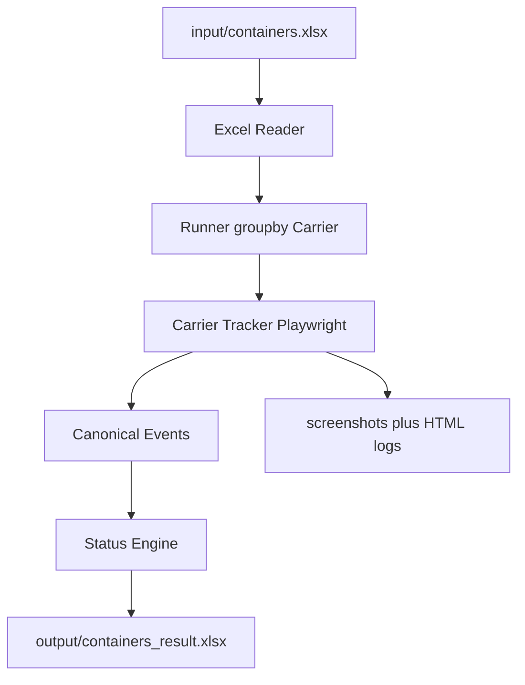

# 集装箱网页自动追踪 MVP 规范（Mac 本地版）

本文是可直接开发的实现规范。叙述用中文；代码标识符、CLI、Excel 表头、状态值、错误信息用英文。

本次仓库交付：本规范 + 输入模板 `input/containers.xlsx`。追踪程序（`app.py` / tracker）按本文后续版本实现，不在本文撰写时编写。

---

## 0. 语言约定

| 范围 | 语言 |
|---|---|
| `design/` 与本规范 | 中文叙述；字段名、命令、枚举保持英文原文 |
| 代码：文件名、模块、类、函数、变量、类型、配置键、测试名 | 英文 |
| 注释与 docstring | 英文 |
| UI：CLI 进度/汇总/`--help`、Excel 表头与单元格、日志给人看的文案、错误信息 | 英文，无中文界面 |
| `README.md`（V1.0） | 操作说明可用中文；其中的命令输出示例必须是英文 UI |

正例：文档写「已开船」，代码和 Excel 只写 `SAILED`。

反例：Excel 状态列写「已开船」；CLI 打印「装船成功」。

例外：输入表若带中文表头（如 `箱号`），只作为 alias 映射到 `Container`。输出表与程序内部一律英文。`data/ports.yaml` 的注释用英文。

---

## 1. 目标、非目标、成功标准

### 1.1 做

在本地 Mac 上，从 Excel 读取集装箱号和船公司，用 Playwright 访问各船公司**公开 Tracking 页**，按**日期最新的一程**判断：

- 是否已装上海船（Loaded）：仅 **feeder 或 mother vessel**（页面只写 Vessel 也算海船）
- 是否已开船（Sailed）：同上；**驳船离港不是开船**
- 船名、航次、实际开船时间（ATD）
- 推断输出 **POL**（本程第一海船装船港）
- 最新 Tracking Event
- 查询是否成功

输入只有 `Container` + `Carrier`，**不填 POL**。

第一阶段不依赖官方 API，不部署服务器，也不使用数据库。

### 1.2 不做

- 官方 API、数据库、服务器
- 并发多 Tab
- 打码平台、伪造 Turnstile token、伪装成已过防护的流量
- 用箱号前缀猜船公司
- 目的港 ATA / ETA / POD（后续再议）

允许处理 Cloudflare / CAPTCHA：**先自动等待**非交互 JS 挑战自行消失并复用同一 Chrome 资料目录；自动手段用尽后**才**弹窗等人点击。不把验证外包给打码服务。

### 1.3 成功标准

不追求 100% 过所有反爬。

- 多数箱号可自动跑完并写出 Excel。易出挑战的船公司（如 HLCU）默认用本机 **headed Chrome + 持久资料目录**
- Loaded / Sailed 不以 Planned / ETD 误判
- 驳船动态不得写成 `SAILED`
- Cloudflare：先短等 JS 挑战自己过，失败则刷新重试；仍过不去才等人点。`--no-wait-challenge` 时不等人，记 `CLOUDFLARE` 并熔断该家
- 6 家船公司目标：约 80%–90% 查询可自动完成

### 1.4 支持船公司

| Carrier Code | 船公司 |
|---|---|
| HLCU | Hapag-Lloyd |
| YMJA | Yang Ming |
| ONEY | Ocean Network Express (ONE) |
| MAEU | Maersk |
| MSCU | MSC |
| CMDU | CMA CGM |

推荐顺序：HLCU → YMJA → ONEY → MAEU → MSCU → CMDU。若 HLCU 因 Cloudflare 无法在 V0.1 跑通，改先做 YMJA / ONEY，不要卡死在第一家。

---

## 2. 架构与模块边界



网页抓取与业务判断拆开：

- Tracker：打开页面、搜箱号、解析成带时间戳的 `CanonicalEvent[]`
- `status_engine.py`：按最新日期选出当前航次，再算状态；**不碰 Playwright**
- HTML fixture 可单测「切航次 + 状态机」

主程序按 Carrier 映射，不关心具体网页结构：

```python
TRACKERS = {
    "HLCU": HapagTracker,
    "YMJA": YangMingTracker,
    "ONEY": OneTracker,
    "MAEU": MaerskTracker,
    "MSCU": MscTracker,
    "CMDU": CmaTracker,
}

tracker = TRACKERS[carrier](browser)
result = await tracker.track(container=container)
```

没有 `--pol`。`TrackResult.pol` 只来自解析。

---

## 3. 数据模型

### 3.1 CanonicalEvent

```python
@dataclass
class CanonicalEvent:
    classifier: Literal["ACT", "PLN", "EST", "UNKNOWN"]
    type: Literal["LOAD", "DEPA", "DISC", "GTIN", "GTOT", "ARRI", "OTHER"]
    location_raw: str
    location_norm: str
    timestamp_raw: str
    event_date: str | None          # YYYY-MM-DD
    event_time: str | None          # HH:MM; never fill "00:00"
    sequence_index: int             # DOM top-to-bottom, 0-based
    vessel: str | None
    voyage: str | None
    booking: str | None
    empty: Literal["true", "false", "unknown"]  # store as bool|None in code
    transport_mode: Literal[
        "MOTHER", "FEEDER", "VESSEL", "BARGE", "TRUCK", "RAIL", "UNKNOWN"
    ]
    raw_text: str
```

实现里 `empty` 用 `bool | None`（`None` = unknown）即可。

### 3.2 空箱

- 明确空箱：`empty` / `mt` / `empty container` / `empty pickup` / `empty return` / `empty load` / `空箱` → `empty=true`
- 明确重箱：`full` / `laden` / `fcl` / `loaded (full)` / `重箱` → `empty=false`
- 海船 `LOAD` / `DEPA` 未写空/重 → unknown，**按重箱计**
- `GTIN` / `GTOT` 未写空/重 → unknown，本来就不计入 Loaded
- **Loaded / Sailed / POL / ATD 只用重箱海船事件**：`empty=false`，或海船 LOAD/DEPA 的 unknown。`empty=true` 的 LOAD/DEPA 一律忽略
- 空箱事件**仍保留**在列表中，用于切航次和 `Latest Event`
- 切航次包含空箱日期。若出现 Actual **empty return / returned to depot / empty in**，其后事件视为更新的一程（还箱后再出租），即使间隔不足 30 天

### 3.3 海船事件 ocean_leg

Loaded / Sailed / POL / ATD **只使用**同时满足以下条件的事件：

- `transport_mode` 为 `MOTHER`、`FEEDER`，或未细分为驳船的 `VESSEL`（页面只写 Vessel / Ship / Vessel departed）
- 通过空箱规则
- `classifier=ACT`
- `type` 为 `LOAD` 或 `DEPA`（Gate in 不是 Loaded）

不计：`BARGE`（含 lighter、驳船）、`TRUCK`、`RAIL`。

`UNKNOWN` 交通方式：**不计入**开船/装船，避免把驳船误判为已开船。

解析关键词（大小写不敏感，接入各家时补全）：

| 文案 | transport_mode |
|---|---|
| barge / lighter / barge vessel / 驳船 | `BARGE` |
| feeder | `FEEDER` |
| mother / ocean vessel / deep sea | `MOTHER` |
| 仅有 vessel / ship | `VESSEL` |

### 3.4 TrackResult

```python
@dataclass
class TrackResult:
    container: str
    carrier: str
    pol: str | None                 # inferred; never from input
    loaded: bool | None             # None if not SUCCESS
    sailed: bool | None
    vessel: str | None
    voyage: str | None
    atd: str | None
    latest_event: str | None
    status: str
    success: bool
    check_result: str               # SUCCESS | MANUAL | FAILED
    error_code: str | None
    error: str | None
    checked_at: str                 # YYYY-MM-DD HH:MM:SS local
    screenshot_path: str | None
    html_path: str | None
    events: list[CanonicalEvent]
```

`pol` 只来自解析，不来自输入。

内部事件对齐 DCSA 思路：`ACT` / `PLN` / `EST` + `LOAD` / `DEPA`。不接官方 API。

---

## 4. 最新航次选择与状态机

输入没有 POL。同一箱号会被多次出租，页面可能混有旧订舱。规则：**只使用日期最新的那一程**。

### 4.1 抓取时（Tracker）

- 页面按 booking 分组或标明 last/current booking：只解析**最新订舱**
- 一次返回多条 shipment：取各条里事件的最大日期，留下最大的那一条
- 不用箱号前缀、不用用户港名过滤

### 4.2 解析后切程（status_engine）

只保留 `latest_journey`，优先级：

1. 事件带 `booking`：按 booking 分组，取「组内最晚事件」最新的一组
2. 否则带 `vessel`+`voyage`：按航次分组，同样取最晚日期最新的一组。**例外**：全部 ACT 日期落在同一 30 天簇时，视为同一程中转换船，不要按航次拆开（否则会丢掉起始港 Actual DEPA，误把后段未开母船当成 `LOADED_WAITING_DEPARTURE`）
3. 否则按时间聚类：有 `event_date` 的事件排序，相邻间隔 **> 30 天** 视为新循环；只留包含全局最晚日期的那一簇。Actual empty return 可作为额外边界（见 3.2）
4. 无任何可解析日期：无法区分旧程 → `MANUAL_CHECK_REQUIRED` / `AMBIGUOUS_JOURNEY`（并截图）

Planned / Estimated 日期**不参与**选航次。选航次只用 `ACT` 日期；该程若还没有任何 ACT，再用该程上最晚的 PLN/EST 仅用于分组。状态不得把 Planned 当成已发生。

### 4.3 只有日期、没有时刻

每个 adapter 声明 `timeline_order`：

- `oldest_first`（默认）：表从上到下从早到晚
- `newest_first`：最新在上

接入该家时用真实页填写，不要猜。

比较「更晚」用复合键，**禁止**把缺失时刻填成 `00:00`：

1. `event_date`
2. 有 `event_time` 则比时刻；双方都没有则这一档相等
3. 平局用 `sequence_index`：`oldest_first` 时 index 更大更晚；`newest_first` 时 index 更小更晚

输出 `ATD`：有时刻写 `YYYY-MM-DD HH:MM`，只有日期写 `YYYY-MM-DD`。

30 天切程只用日期差。

单测：同一天 Load 然后 Depart 且都无时刻 → 必须判 `SAILED`。

### 4.4 状态优先级（只看 latest_journey 的 ocean_leg）

1. 存在 `ACT + DEPA` 且为 `ocean_leg` → `SAILED`。`ATD` / 船名 / 航次取该程里**最早**的一条此类 Actual DEPA（起始港开船，不是中转后段）。**驳船离港不是开船。**
2. 否则存在 `ACT + LOAD` 且为 `ocean_leg` → `LOADED_WAITING_DEPARTURE`。船名 / 航次取该程里**最晚**的一条此类 Actual LOAD
3. 页面有有效结果但以上都没有（例如只有驳船动态）→ `NOT_LOADED`
4. CAPTCHA / 无法切航次 → `MANUAL_CHECK_REQUIRED`
5. 超时、DOM 变、无结果无法解析 → `CHECK_FAILED`

`Check Result` 映射：

| Status | Check Result |
|---|---|
| `NOT_LOADED` / `LOADED_WAITING_DEPARTURE` / `SAILED` | `SUCCESS` |
| `MANUAL_CHECK_REQUIRED` | `MANUAL` |
| `CHECK_FAILED` | `FAILED` |

SUCCESS 时 `Loaded` / `Sailed` 填 `YES` 或 `NO`。失败或人工时这两列留空（空 ≠ 未装船）。

### 4.5 输出 POL（推断，不读输入）

- 取 `latest_journey` 里**最早**一条 `ocean_leg` + `ACT + LOAD` 的地点，经 `ports.yaml` 规范化（如 `CNYTN` → `YANTIAN`）
- 驳船装船地点不当作 POL
- 尚无海船 Actual LOAD、失败、需人工：留空
- `POL` = 本程第一海船装船港。不另输出中转后的装船港或装船时间

### 4.6 硬规则

- Gate in ≠ Loaded
- ETD / Planned / Estimated ≠ Sailed
- Barge DEPA ≠ Sailed；Barge LOAD ≠ Loaded
- 空箱 LOAD/DEPA 不算装船开船
- 同一程已中转：Loaded/Sailed 只看海船；`ATD` / 船名 / 航次用最早海船 Actual DEPA；`POL` 用最早海船 LOAD
- Latest Event = 该程按复合键最晚的 `ACT`（可含驳船、空箱）
- 时区不明不强转 UTC；保留 `timestamp_raw`

### 4.7 港口显示名

`data/ports.yaml` **只规范化输出** `POL`，不参与输入，也不参与是否装船/开船。Chiwan / Mawan 不强行等同 Shekou。

MVP 种子别名（大小写不敏感）：

```yaml
YANTIAN:
  aliases: [YANTIAN, "YANTIAN, CHINA", CNYTN, YICT, "YANTIAN PT"]
NANSHA:
  aliases: [NANSHA, "NANSHA, CHINA", CNNSA, "GUANGZHOU NANSHA"]
SHEKOU:
  aliases: [SHEKOU, "SHEKOU, CHINA", CNSHK]
```

匹配：规范化（大写、去空格/标点）→ 别名精确匹配 → 别名被 location 包含或相反。匹配不上则输出原始 `location_norm`，不因此失败。

---

## 5. 输入、输出与 CLI

MVP 只产出 Excel + 终端，不产出 JSON/CSV。截图/HTML 是旁路文件。

### 5.1 输入 Excel

只接受 `.xlsx`。用 pandas + openpyxl。读输入时先把文件拷到临时路径再读，以便 Excel 开着输入表时通常仍能跑；拷贝失败则英文报错退出。

- 默认路径：`input/containers.xlsx`
- 只读**第一个 sheet**（模板名为 `Containers`；自定义文件 sheet 名随意）
- 第 1 行必须是表头，无合并单元格
- 空行跳过
- 缺必填表头 → 进程退出，不开始查询

仓库内置模板：`input/containers.xlsx`（见 5.1.1）。用户把箱号贴到 `Container` 列第 2 行起，再填 `Carrier`。

#### 5.1.1 模板规格

- Sheet 1 `Containers`（程序读这个）
  - A1 `Container`，B1 `Carrier`（英文、加粗、冻结首行）
  - A2:A101、B2:B101 预留空行，方便整列粘贴
  - `Carrier` 为普通文本，**无下拉、无数据验证**
  - 无 `POL` 列；不放示例箱号
- Sheet 2 `Instructions`（英文，程序忽略）
  - Paste container numbers into column A starting at row 2
  - Type a Carrier code in column B for each row: HLCU, YMJA, ONEY, MAEU, MSCU, or CMDU
  - Save this file, then run: `python app.py input/containers.xlsx`

不另做 `containers.sample.xlsx`。

#### 5.1.2 必填列

顺序不限。

| Column | 规则 | 合法示例 | 非法处理 |
|---|---|---|---|
| `Container` | 去空格、去横线后大写；形态 `AAAA#######`。ISO 6346 校验位错误只告警仍查询 | `HLXU1234567` | 空 → 该行 `CHECK_FAILED` / `INVALID_INPUT`，不打开网页 |
| `Carrier` | 去空格大写；必须是六码之一。以本列为准，**不用箱号前缀猜船公司** | `HLCU` | 未知 → `UNSUPPORTED_CARRIER`，不打开网页 |

**没有输入 POL 列。** 若多了一列 `POL`，透传时改名为 `POL_input`，不得覆盖输出推断的 `POL`。

Carrier 枚举：`HLCU` | `YMJA` | `ONEY` | `MAEU` | `MSCU` | `CMDU`

表头 alias（只用于读入）：

- `Container` ← `Container No.` / `Container Number` / `Ctr No` / `箱号` / `集装箱号`
- `Carrier` ← `Carrier Code` / `SCAC` / `船公司`

其他列（`Booking`、`BL`、`Customer` 等）原样透传到输出标准列之后。MVP 不拿 Booking/BL 去查。即使填了 Booking，选航次仍以页面上日期最新的一程为准。

列名与输出标准列冲突（`Status`、`Loaded`、`ATD`、`POL` 等）时，透传改名为 `{Column}_input`。

重复行：读入时按 `Container+Carrier` 去重，保留首行。然后按船公司分组再查（同一家连续查完）。不提供按原始行全查。

文字样例（不是第二份 xlsx）：

```text
Container     Carrier
HLXU1234567   HLCU
YMLU1234567   YMJA
TCLU1234567   ONEY
MSKU1234567   MAEU
MSCU1234567   MSCU
CMAU1234567   CMDU
```

行级错误不中断整批。只有文件级错误（缺文件、缺必填表头、不是 xlsx）才退出。

### 5.2 输出 Excel

- 路径：`output/containers_result.xlsx`（`--output` 可改）
- Sheet 名：`Results`
- 单元格一律文本（日期也当文本），避免 Excel 序列号弄乱 `ATD`
- 不写第二张 events sheet
- 结果行集 **永远等于当前输入表**（同样行序、同样透传列）。输入里删掉的箱号，结果里必须消失

#### 默认（不带 `--resume`）= 新跑

- 忽略已有结果里的业务字段，按输入重建
- 未查到的行：标准结果列留空（不用上次的 `SAILED`）
- 每查完一行，把**整张当前表**写盘（已查有结果，未查空白）
- 崩溃后再跑：不带 `--resume` 会重查全部；带 `--resume` 才接上次

#### `--resume`

- 用 `Container`+`Carrier` 对齐（同一输入多次出现则用行序）
- 仍在输入中且 `Status=SAILED` → 跳过，沿用旧行
- `CHECK_FAILED` / `MANUAL_CHECK_REQUIRED` → 重查
- `NOT_LOADED` / `LOADED_WAITING_DEPARTURE` → 也重查（货物会变）；只有 `SAILED` 是终态
- 旧结果有、当前输入没有 → 丢掉
- 输入新增 → 当新行查询

#### Excel 占用文件

不要要求用户先关 Excel 才能跑，也不要去关 Excel。

- 写结果：先写 `output/containers_result.xlsx.partial`，再 `os.replace` 成正式名
- 正式名仍被锁：改写 `output/containers_result_YYYYMMDD_HHMMSS.xlsx`，终端打印最终路径。`--resume` 时用 `--output` 指向该文件
- 英文提示：`Output file is open in Excel. Wrote output/containers_result_20260911_235900.xlsx instead.`

#### 标准列（固定顺序，英文表头）

| Column | 含义 |
|---|---|
| `Container` | 箱号，如 `HLXU1234567` |
| `Carrier` | 如 `HLCU` |
| `POL` | 推断的海船起运港，非输入。尚未上海船/失败/人工时留空 |
| `Status` | `NOT_LOADED` / `LOADED_WAITING_DEPARTURE` / `SAILED` / `MANUAL_CHECK_REQUIRED` / `CHECK_FAILED` |
| `Loaded` | `YES` / `NO` / 空。仅 SUCCESS 时填 |
| `Sailed` | 同上 |
| `Vessel` | `SAILED` 时取最早海船 Actual DEPA 的船名；已装未开时取最晚海船 Actual LOAD。不含驳船 |
| `Voyage` | 航次 |
| `ATD` | 最早海船 Actual DEPA（本程离开 POL 的时间）；不含驳船、不含空箱 |
| `Latest Event` | 英文短句，如 `Vessel departed YANTIAN` |
| `Checked At` | 本机查询时间 `YYYY-MM-DD HH:MM:SS` |
| `Check Result` | `SUCCESS` / `MANUAL` / `FAILED` |
| `Error Code` | 成功空 |
| `Error` | 英文一句；成功空 |
| `Screenshot` | 相对路径，如 `screenshots/HLXU1234567_20260911_233800.png` |

其后为输入透传列。

已开船样例：

```text
HLXU1234567 | HLCU | YANTIAN | SAILED | YES | YES | MONTEVIDEO EXPRESS | 2632E | 2026-09-11 03:40 | Vessel departed YANTIAN | 2026-09-11 23:38:00 | SUCCESS
```

仅有驳船动态：`Status=NOT_LOADED`，`Loaded=NO`，`Sailed=NO`，`POL` / 船名航次 / `ATD` 为空。

查询失败：`Status=CHECK_FAILED`，`POL`/`Loaded`/`Sailed` 等为空，`Check Result=FAILED`，`Error Code=CLOUDFLARE`。

### 5.3 旁路文件

| 类型 | 路径 |
|---|---|
| 截图 | `screenshots/{CONTAINER}_{YYYYMMDD}_{HHMMSS}.png`，只截箱号查询结果区域（事件表 / Latest Event）。Cookie 横幅、登录框、Cloudflare 挑战页不进该目录 |
| HTML | `logs/html/{CONTAINER}_{YYYYMMDD}_{HHMMSS}.html` |
| 运行日志 | `logs/run_{YYYYMMDD}_{HHMMSS}.log`（英文） |

单箱 CLI 默认只打终端；指定 `--output` 才写 xlsx。

### 5.4 CLI

全部英文。没有 `--pol`。默认 **headless 无人值守**。`--headed` 仅供开发看页面。不提供 `--pause-on-captcha`。

单箱：

```bash
python app.py --carrier HLCU --container HLXU1234567
```

批量：

```bash
python app.py input/containers.xlsx
```

公共参数：`--headed` `--limit` `--carriers` `--resume` `--output`

终端样例：

```text
Container Tracker
===================================

[1/18] HLCU  HLXU1234567
        Loaded: YES
        Sailed: YES
        ATD:    2026-09-11 03:40
        Status: SAILED

[2/18] YMJA  YMLU1234567
        Loaded: YES
        Sailed: NO
        Status: LOADED_WAITING_DEPARTURE

[3/18] MSCU  MSCU1234567
        Status: MANUAL_CHECK_REQUIRED
        Error:  CAPTCHA

===================================
Summary
  SAILED                       11
  LOADED_WAITING_DEPARTURE      3
  NOT_LOADED                    3
  MANUAL_CHECK_REQUIRED         1
  CHECK_FAILED                  0

Output: output/containers_result.xlsx
```

### 5.5 config.py

- 全局 timeout
- 查询间隔 2–4 秒（`random.uniform(2, 4)`）；`CHALLENGE_CARRIERS`（HLCU、MSCU、MAEU、CMDU）5–8 秒
- Cloudflare 自动等待 `AUTO_CHALLENGE_WAIT_MS`（约 25s），人工兜底 `CHALLENGE_WAIT_MS`（180s）
- 挑战未过：刷新 tracking URL 最多 2 次，间隔 5s / 15s
- locale `en-US`
- 默认 headless；`CHALLENGE_CARRIERS` 默认 headed
- 每家持久 Chrome 资料目录 `sessions/chrome_{carrier}/`（不要每箱重开浏览器）
- 按 Carrier 可覆盖 delay / timeout

---

## 6. Tracker、浏览器、失败处理

### 6.1 运行方式

- 一个 Browser；读入先按 `Container+Carrier` 去重，再 `groupby("Carrier")` 后**顺序**查询；不并发
- 无挑战站点默认 headless；`CHALLENGE_CARRIERS`（HLCU、MSCU、MAEU、CMDU）默认 headed + 持久资料目录
- Cookie Banner 用选择器自动关
- 同一 Carrier **全程一个** persistent context，箱与箱之间只拉开间隔，**不要每箱杀浏览器**
- 流程：打开 Tracking 页（已在该站且无挑战则复用）→ 自动等待 JS 挑战 → 关 Cookie → 用页面表单输入箱号。CMDU / MAEU 与 HLCU 相同，不用 GET search / 箱号深链
- CAPTCHA / Cloudflare / DataDome / Akamai：先在同一页短等 JS 挑战。仍在挑战页则**交给普通系统 Chrome**（同一 `user_data_dir`，不开 remote debugging，避免 DataDome 直接判失败）。人点完后可在该页查询；查完关掉窗口后程序用已解锁会话继续。不要在 Playwright 窗口里点勾。`--no-wait-challenge` 才刷新重试或不等人。不打码、不伪造 token
- `--headed` 强制所有船公司可见窗口。查询结果页才截图（结果区域，不含登录/cookie）；Cloudflare 页只留 HTML。失败仍保存 `page.content()`

不能承诺 6 家 100% 自动。Hapag 等站点的非交互挑战应尽量自动过；需要点击时同一 Chrome 资料目录等人点一次，后续箱复用。连续两箱 `SELECTOR` / `CLOUDFLARE` 停查该家。

### 6.2 BaseTracker

```python
class BaseTracker:
    timeline_order: Literal["oldest_first", "newest_first"] = "oldest_first"

    async def open_page(self) -> None: ...
    async def search(self, container: str) -> None: ...
    async def parse_events(self) -> list[CanonicalEvent]: ...

    async def track(self, container: str) -> TrackResult:
        # open_page, search, parse_events, then status_engine
        ...
```

各船公司只实现 `open_page` / `search` / `parse_events`。`track()` 调用 status engine。

### 6.3 错误码

`INVALID_INPUT` / `UNSUPPORTED_CARRIER` / `TIMEOUT` / `NAVIGATION` / `SELECTOR` / `NO_RESULT` / `CAPTCHA` / `PARSE` / `CLOUDFLARE` / `AMBIGUOUS_JOURNEY`

某家突然全是 `SELECTOR` / `CLOUDFLARE` 时，停查该家，不影响其他 Carrier。

---

## 7. 目录

```text
container_tracker/
├── app.py
├── config.py
├── status_engine.py
├── ports.py
├── excel_io.py
├── cli.py
├── requirements.txt
├── trackers/
│   ├── __init__.py
│   ├── base.py
│   ├── hapag.py
│   ├── yangming.py
│   ├── one.py
│   ├── maersk.py
│   ├── msc.py
│   └── cma.py
├── data/
│   └── ports.yaml
├── input/
│   └── containers.xlsx
├── output/
├── logs/
│   └── html/
├── screenshots/
├── sessions/
├── tests/
│   ├── test_status_engine.py
│   ├── test_ports.py
│   └── fixtures/{carrier}/*.html
└── design/
    └── container_tracking_mvp_plan.md
```

`requirements.txt` 钉版本：`playwright`、`pandas`、`openpyxl`、`pyyaml`。

`.gitignore` 应忽略：`.venv/`、`sessions/`、`screenshots/`、`output/`、`logs/`、`*.partial`。`input/containers.xlsx` 作为模板提交；若日后含真实箱号，可改为忽略并另存模板副本。

---

## 8. 船公司附录

每家：公开 URL、已知风险、`timeline_order`（接入时填写）、事件文案待填。不在规范里写死 selector。

| Code | URL | 主要风险 |
|---|---|---|
| HLCU | [Track by container](https://www.hapag-lloyd.com/en/online-business/track/track-by-container-solution.html) | Cloudflare Managed Challenge（已实测） |
| YMJA | [Cargo tracking](https://www.yangming.com/en/esolution/tracking/cargo_tracking) | 可能支持多箱；MVP 仍逐箱 |
| ONEY | [ONE cargo tracking](https://www.one-line.com/one-ecom/manage-shipment/cargo-tracking) | 旧版 ecomm 与新站并存；`oldest_first` |
| MAEU | [maersk.com/tracking](https://www.maersk.com/tracking/) | 强反爬、动态渲染；与 HLCU 相同走表单+Chrome 交接；`oldest_first` |
| MSCU | [Track a shipment](https://www.msc.com/en/track-a-shipment) | CAPTCHA、OneTrust、动态加载；`newest_first` |
| CMDU | [CMA tracking](https://www.cma-cgm.com/ebusiness/tracking) | DataDome、会话超时；与 HLCU 相同走表单+Chrome 交接，不用 GET search；还箱超过约 15 天可能无结果；`oldest_first` |

### 8.1 HLCU 研究步骤（V0.1）

有头浏览器打开 Tracking 页 → 处理 Cookie → 输入箱号 → 保存 HTML 与截图 → 标出 Actual 行与 Planned 行 → 映射到 `LOAD` / `DEPA` → 确认表格是 `oldest_first` 还是 `newest_first` → 填事件关键词表。

若 Cloudflare 过不去：该行 `CLOUDFLARE`，改先接入 YMJA。

### 8.2 事件关键词表（接入时用真实 HTML 填）

每家一张，列：页面原文、`classifier`、`type`、`transport_mode`、`empty`。

ONEY（日期容器 `text-ds-grey-darker-1` = ACT，`text-ds-grey-darker-2/3` = EST；地点可继承上一行国家）：

| 页面原文 | classifier | type | transport_mode | empty |
|---|---|---|---|---|
| Empty Container Release to Shipper | ACT | GTOT | UNKNOWN | true |
| Gate In to Outbound Terminal | ACT | GTIN | UNKNOWN | — |
| Loaded on Vessel at Port of Loading | ACT | LOAD | VESSEL | — |
| Vessel Departure from Port of Loading | ACT | DEPA | VESSEL | — |
| Vessel Arrival at Port of Discharge | ACT/EST | ARRI | VESSEL | — |
| Unloaded from Vessel at Port of Discharging | EST | DISC | VESSEL | — |
| Full Container Delivery to Consignee | EST | GTOT | UNKNOWN | false |
| Empty Container Returned from Customer | EST/ACT | GTIN | UNKNOWN | true |

MSCU（时间线新→旧。没有 Vessel Departed 时，Actual **Export Loaded on Vessel** 视为已开船，ATD 用该事件日期；若页面已有 Actual Vessel Departed，仍用离港时间）：

| 页面原文 | classifier | type | transport_mode | empty |
|---|---|---|---|---|
| Empty to Shipper | ACT | GTOT | UNKNOWN | true |
| Export received at CY | ACT | GTIN | UNKNOWN | false |
| Export Loaded on Vessel | ACT | LOAD（并补 DEPA） | VESSEL | — |
| Vessel Departed | ACT | DEPA | VESSEL | — |
| Import Discharged from Vessel | ACT | DISC | VESSEL | — |
| Import to consignee | ACT | GTOT | UNKNOWN | false |
| Empty received at CY | ACT | GTIN | UNKNOWN | true |

MAEU（时间线旧→新。页面由 `synergy/tracking` JSON 渲染；`Loaded` 不是开船，必须有 Actual Vessel Departed）：

| 页面原文 | classifier | type | transport_mode | empty |
|---|---|---|---|---|
| Gate Out Empty | ACT | GTOT | UNKNOWN | true |
| Gate In Full | ACT | GTIN | UNKNOWN | false |
| Loaded | ACT | LOAD | VESSEL | — |
| Vessel Departed | ACT | DEPA | VESSEL | — |
| Vessel Arrived | ACT/EST | ARRI | VESSEL | — |
| Discharged | ACT | DISC | VESSEL | — |
| Gate Out Full | ACT | GTOT | UNKNOWN | false |
| Empty Return | ACT | GTIN | UNKNOWN | true |

CMDU（时间线旧→新。PastMoves / CurrentMoves 为 ACT，ProvisionalMoves 为 EST。**READY TO BE LOADED 不是装船**）：

| 页面原文 | classifier | type | transport_mode | empty |
|---|---|---|---|---|
| EMPTY TO SHIPPER | ACT | GTOT | UNKNOWN | true |
| READY TO BE LOADED | ACT | GTIN | UNKNOWN | — |
| LOADED ON BOARD | ACT | LOAD | VESSEL | — |
| VESSEL DEPARTURE | ACT | DEPA | VESSEL | — |
| VESSEL ARRIVAL | ACT/EST | ARRI | VESSEL | — |
| DISCHARGED / DISCHARGED IN TRANSHIPMENT | ACT | DISC | VESSEL | — |
| EMPTY RETURN | ACT | GTIN | UNKNOWN | true |

---

## 9. 开发阶段

只保留这一套阶段。Excel 批量在 HLCU 单箱跑通之后（V0.2），不要等 6 家都接完。截图/HTML/日志从 V0.1 就有。

| 版本 | 内容 |
|---|---|
| V0.1 | 脚手架 + 最新航次/status engine 单测 + HLCU 单箱 CLI（可用 `--headed`）+ 截图/HTML/日志 |
| V0.2 | HLCU Excel 批量、groupby、整表增量写盘、基础 CLI |
| V0.3 | YMJA + ONEY（ONEY 已接入） |
| V0.4 | MAEU + MSCU + CMDU（三家均已接入） |
| V0.5 | session 复用、失败重试 1 次、`--resume` / 跳过 SAILED、汇总统计 |
| V1.0 | 6 家默认 headless 无人值守；英文 CLI 进度与汇总；README 使用说明可用中文 |

V0.1 用 3–5 个真实 HLCU 箱号验收：未装船 / 已装未开 / 已开船。单测 fixture 必须覆盖「驳船已离港但海船未开 → `NOT_LOADED` 或 `LOADED_WAITING_DEPARTURE`，不得 `SAILED`」。禁止用 Planned 日期的箱子当 `SAILED` 金样例。最好再有一个旧程+新程的循环箱。

---

## 10. 测试、维护、合规

### 10.1 测试

- 单测不跑浏览器：切航次（含箱号循环）、空箱 LOAD 不得 `SAILED`、同一天无时刻 Load→Depart 必须 `SAILED`、status engine、Excel 读写（临时 xlsx）
- `ports.yaml` 只测显示名规范化
- Parser 回归：`tests/fixtures/{carrier}/` 保存成功页 HTML；selector 失效时先对 fixture 修解析再开网页

### 10.2 维护

某家突然全 `SELECTOR` / `CLOUDFLARE` → 停查该家，不影响其他 Carrier。

### 10.3 合规

仅公开 Tracking 页、顺序慢查、仅本地自用。自动等待 Cloudflare JS 挑战、必要时真人点击；不用打码平台、不伪造防护 token。站点 ToS 变化时停用对应 adapter。

### 10.4 后续迁移（附录，不占实现篇幅）

模块化的统一数据结构、Carrier Adapter、Status Engine 可迁到企业 Windows（Playwright + Edge）、Power Platform，或云端容器。MVP 不必为此提前实现。

---

## 11. 已对齐决策

- 输入无 POL；输出有推断 POL
- 最新日期切航次；Actual ≠ Planned
- 开船仅 feeder / mother（驳船不算）；交通方式 UNKNOWN 也不算开船
- 空箱 LOAD/DEPA 不算装船开船；empty return 可作为新程边界
- 无时刻不补 `00:00`；用页面顺序打破平局
- 结果行 = 当前输入；Excel 锁文件则改写时间戳文件
- 默认：自动过 JS 挑战，失败再等人点；`--no-wait-challenge` 才无人值守失败
- 不用打码平台、不伪造 WAF/Turnstile token
- 代码/注释/UI 英文；本规范中文

---

## 12. 风险

1. **驳船 vs 海船**：已定口径见第 3–4 节。网页若把驳船只写成 Vessel，仍可能误判；关键词表要在接入时用真实 HTML 补全。
2. **境内访问**：Hapag / Maersk / MSC 从内地 Mac 可能慢、被拦或出 Cloudflare。V0.1 过不去就换 YMJA/ONEY。
3. **真实箱号**：没有未装船 / 已装未开 / 已开船的真箱，selector 和 Actual 规则都验不了。
4. **Headless 检测**：部分站点对无头浏览器更严。HLCU 等默认 headed 持久 Chrome；无挑战站点仍 headless。自动等不过再等人点。
5. **自动化边界**：不能 100% 过所有反爬。V1.0 可用 launchd/cron 定时跑成功路径。

---

## 13. 实施路径

```text
HLCU 单箱 CLI + 截图/HTML + status engine 单测
  → 验证：查询 → Events → Actual/Planned → 切航次 → 海船 Loaded/Sailed → 推断 POL
YMJA → 第二种页面
ONEY → 通用 Adapter
Excel 批量 + 整表写盘
MAEU / MSCU / CMDU
Session、retry、resume
MVP 完成
```

第一步不要直接做 6 家。先用 3–5 个真实 HLCU 箱号把闭环跑通，后续 5 家主要是不同网页 Adapter。
